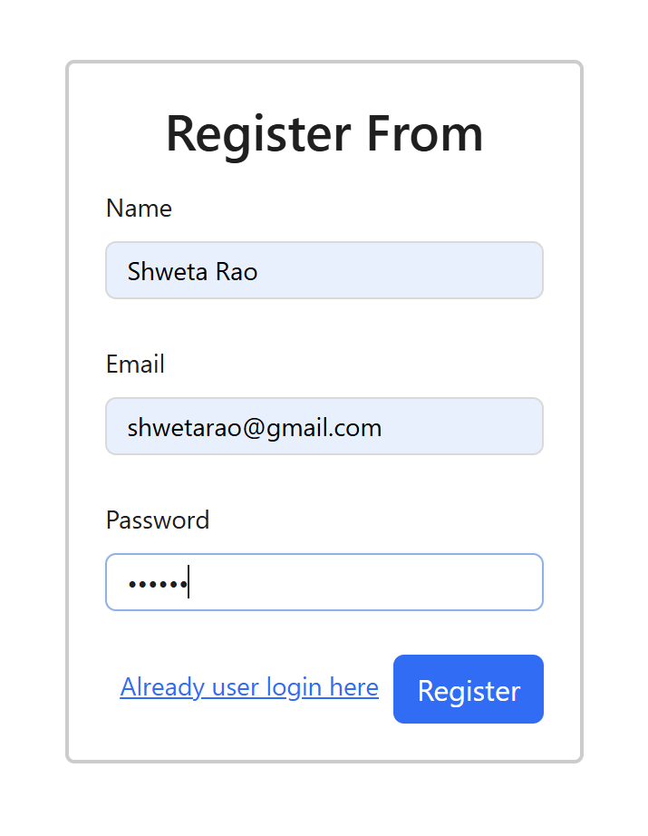
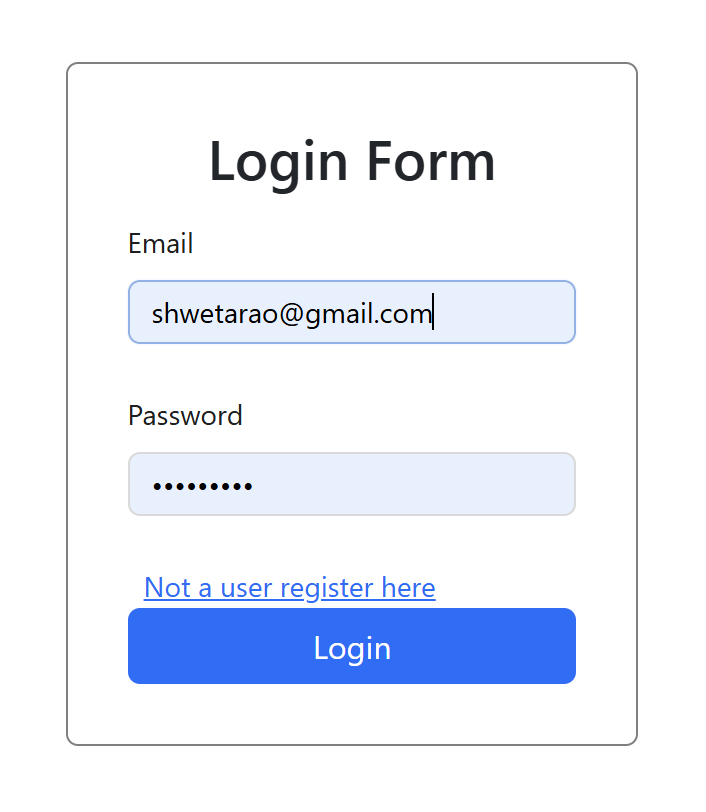

# 🏥 Doctor Appointment System

A full-stack Doctor Appointment System built using the **MERN Stack** (MongoDB, Express.js, React.js, Node.js). Patients can book appointments, doctors can manage bookings, and admins can oversee the entire system.

---

## 🚀 Tech Stack

- ⚛️ **Frontend:** React.js, Redux, React Router
- 🧠 **Backend:** Node.js, Express.js
- 🗄️ **Database:** MongoDB (Mongoose)
- 🔐 **Authentication:** JWT
- 📦 **File Uploads:** Multer
- 💬 **(Optional) Real-Time Chat:** Socket.io
- 🌐 **Deployment:** Vercel (Frontend), Heroku (Backend), MongoDB Atlas (Database)

---

## 👥 User Roles & Features

### 👤 Patient
- 📝 Register and log in
- 👨‍⚕️ Browse available doctors
- 📅 Book and cancel appointments
- 📄 View appointment history

### 👨‍⚕️ Doctor
- 🔐 Login to their dashboard
- 📋 View and manage appointments
- 📌 Accept or reject requests
- 🕐 Update availability

### 🛡️ Admin
- 👥 Manage all users (doctors & patients)
- ✅ Approve new doctor registrations
- 📊 Monitor all appointments
- 📈 View reports and analytics

---

## 📸 Screenshots

### 👤  Register Page

### 👤  Login Page

### 👤 Patient Home Page

### 👨‍⚕️ Patient Appointment Status

### 👨‍⚕️ Apply as Doctor

### 👨‍⚕️ Doctor Appointment List

### 👨‍⚕️ Doctor Profile Page

### 👨‍⚕️ Doctor Appointment Notification

### 🛡️ Admin Page - Doctor List

### 🛡️ Admin Page - User List

### 🛡️ Admin Doctor Notification

